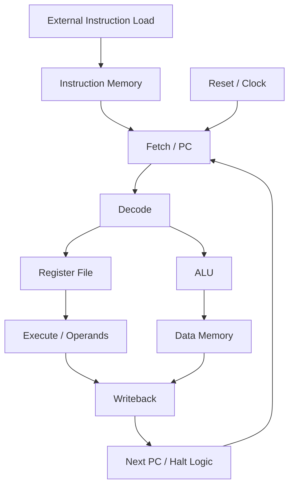
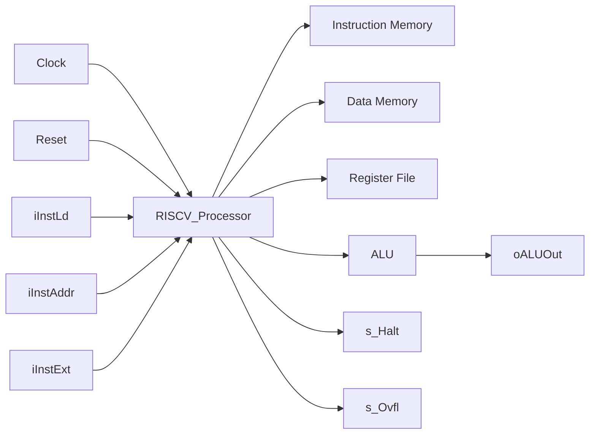
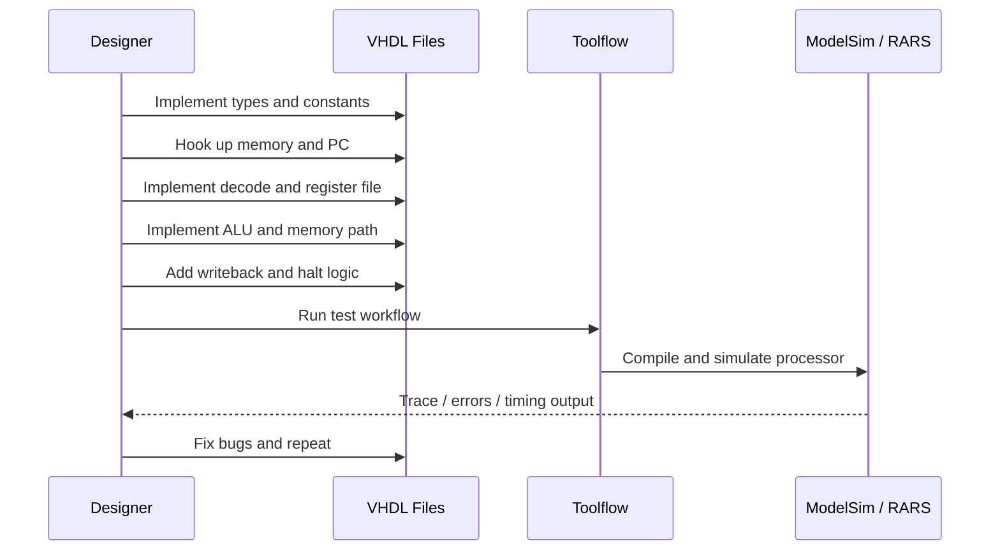

# RISC-V Processor Implementation Guide

This project is a CPRE 3810 toolflow starter for a small RISC-V processor written in VHDL. The code in [src/TopLevel/RISCV_Processor.vhd](src/TopLevel/RISCV_Processor.vhd) is intentionally a skeleton: the top-level entity, memory interfaces, and required control signals are present, but most of the processor behavior still needs to be implemented.

The goal of this guide is to help you turn the skeleton into a working single-cycle or simple control-driven RISC-V processor and validate it using the provided toolflow.

---

## 1. What the skeleton already gives you

The starter file already includes the key interfaces needed by the grading/testbench:

- Instruction memory interface through `s_IMemAddr`, `s_Inst`, and `IMem`
- Data memory interface through `s_DMemWr`, `s_DMemAddr`, `s_DMemData`, and `s_DMemOut`
- Register write interface through `s_RegWr`, `s_RegWrAddr`, and `s_RegWrData`
- Program counter through `s_PC`
- Halt signal through `s_Halt`
- Overflow signal through `s_Ovfl`

The important design rule is that the toolflow expects these signals to be driven correctly, because the testbench reads them directly.

The file also contains the required memory mapping behavior:

- Instruction memory is addressed using `s_IMemAddr(11 downto 2)`
- Data memory is addressed using `s_DMemAddr(11 downto 2)`
- External loading is supported through `iInstLd` and `iInstAddr`
- The final instruction address must be `s_PC`, not a raw signal directly from the external port

---

## 2. High-level processor architecture

This is the conceptual pipeline for the processor you need to build. At a high level, the design is:

1. Fetch the current instruction from instruction memory using the program counter.
2. Decode the instruction to determine the operation and sources.
3. Read operands from the register file.
4. Compute an ALU result or memory address.
5. Write to data memory if needed.
6. Write back results to the register file.
7. Update the PC.
8. Stop execution when the correct halt instruction is encountered.

---

## 3. Top-level memory and control view

The actual implementation is centered around the skeleton in [src/TopLevel/RISCV_Processor.vhd](src/TopLevel/RISCV_Processor.vhd). The dependent pieces are usually modeled as separate VHDL components or internal processes:

- Instruction memory: `mem` entity
- Data memory: `mem` entity
- Register file: custom VHDL array or record structure
- ALU: custom combinational logic
- PC update logic: process driven by clock and reset
- Control/Decode: instruction decode and enable selection

---

## 4. Step-by-step implementation plan

### Step 1: Define the project-wide types and constants

Use [src/RISCV_types.vhd](src/RISCV_types.vhd) to declare anything you want to share across the design:

- `DATA_WIDTH` = 32
- `ADDR_WIDTH` = 10
- any custom records for control words or pipeline register state
- any register file array type if you will use one

This helper package is compiled first, so this is the safest place to declare shared constants and types.

### Step 2: Connect the required memory and control signals

In [src/TopLevel/RISCV_Processor.vhd](src/TopLevel/RISCV_Processor.vhd):

- Keep the instruction memory instance connected to `s_IMemAddr`
- Keep the data memory instance connected to `s_DMemAddr`, `s_DMemData`, and `s_DMemWr`
- Make sure `s_PC` is the final instruction address source
- Keep `s_Ovfl <= '0'` unless you intentionally support overflow exceptions
- Leave the instruction memory loading logic intact so synthesis does not optimize the memory away

This is important because the toolflow expects the memory contents to be loadable and visible during simulation.

### Step 3: Build the program counter and fetch stage

Your processor must do this repeatedly:

- Start with the reset state
- Load the initial instruction address
- Fetch the instruction from instruction memory
- Increment or update `s_PC` depending on instruction class

For a simple single-cycle CPU, a good rule is:

- `s_PC` is updated on each clock edge
- `next_pc` is calculated from the current instruction and branch target
- reset initializes the PC to zero

A simple fetch logic is usually:

- `s_Inst <= IMem(s_PC)`
- `s_PC <= s_PC + 4` by default
- branch/jump instructions overwrite the default PC update

### Step 4: Decode the instruction

The RISC-V instruction format is the key to the whole processor. You need to decode at least these fields:

- opcode
- funct3
- funct7
- rs1, rs2, rd
- immediate values for I-type, S-type, B-type, U-type, and J-type instructions

At minimum, the implementation should support the instructions your test programs use. In most CPRE 381 projects, this includes:

- arithmetic and logical operations
- add/sub immediate
- loads and stores
- branches
- jumps
- halt instruction detection

The halt instruction is described in the skeleton comments:

- opcode: `1110011`
- funct3: `000`
- funct12: `000100000101`

This is the pattern used by the simulator to recognize the completion of code.

### Step 5: Implement the register file

The register file is the main source of architectural state for the processor. It should:

- read two source registers (`rs1`, `rs2`)
- write one destination register (`rd`) when `s_RegWr` is asserted
- drive `s_RegWrAddr` and `s_RegWrData`

Typical design pattern:

- combinational read path from register file array
- synchronous write on clock edge when write enable is high

The testbench watches `s_RegWr`, `s_RegWrAddr`, and `s_RegWrData` to log writes, so these signals must be correct.

### Step 6: Implement the ALU and ALU control

The ALU must support the operations required by the instruction set, for example:

- addition
- subtraction
- bitwise AND/OR/XOR
- shift left/right
- comparison for branches

Use the instruction fields to select the correct operation. The ALU output should be connected to `oALUOut` for synthesis visibility and to the signal path used by the rest of the design.

### Step 7: Implement memory operations

Data memory is handled by the `mem` component, and the key signals are:

- `s_DMemWr` → write enable
- `s_DMemAddr` → address
- `s_DMemData` → data being written
- `s_DMemOut` → data read back from memory

A simple memory access flow is:

- compute an address from the ALU result or register value
- for load instructions, read from `DMem` into the chosen register
- for store instructions, write the source register value to `DMem`

### Step 8: Implement writeback and PC updates

After an instruction finishes execution, the result must be written to the destination register if required.

The writeback step usually selects between:

- ALU result
- memory read result
- immediate or PC-relative value
- branch/jump target address

Then the next PC is chosen:

- normal sequential increment: `PC + 4`
- branch taken: computed branch target
- jump: computed jump target
- default path: no change except next sequential fetch

### Step 9: Generate the halt signal correctly

The testbench stops execution when the processor sets `s_Halt` high.

This is not a general CPU trap; it is specifically the signal that indicates the program has reached the simulated completion state. The skeleton comments identify the exact WFI/halt pattern to recognize.

In practice, this means:

- decode the instruction fields
- detect the halt opcode and funct3/imm match
- set `s_Halt <= '1'` when the halt instruction is reached

If `s_Halt` is not asserted at the right time, the toolflow may time out or the simulation may not stop correctly.

### Step 10: Test, debug, and iterate

Use the provided toolflow after each major stage:

- `./3810_tf.sh test`
- fix decode or data-path errors
- re-run tests after every processor improvement

The workflow in [../3810_tf.sh](../3810_tf.sh) shows the recommended order:

1. Create project
2. Build processor in the `proj` directory
3. Run tests frequently
4. Synthesize when logic is stable
5. Package submission when ready

---

## 5. Recommended design flow

This is the safest order because it keeps the project modular and lets you validate one stage before moving to the next.

---

## 6. Practical implementation checklist

Use this checklist as you build the CPU:

- [ ] Define constants and helper types in [proj/src/RISCV_types.vhd](src/RISCV_types.vhd)
- [ ] Keep instruction and data memory interfaces connected in [proj/src/TopLevel/RISCV_Processor.vhd](src/TopLevel/RISCV_Processor.vhd)
- [ ] Implement reset and PC initialization
- [ ] Implement fetch from instruction memory
- [ ] Implement instruction decode for the needed opcodes
- [ ] Implement register file reads/writes
- [ ] Implement ALU operations
- [ ] Implement data memory load/store path
- [ ] Implement writeback and PC update
- [ ] Detect the halt instruction and drive `s_Halt`
- [ ] Run the toolflow tests and fix mismatches

---

## 7. Final advice

The skeleton is intentionally minimal, but it is enough to build a working processor if you follow the same pattern used in most CPRE 381 designs:

- keep the top-level signal interface fixed
- decode instructions before choosing control signals
- make the ALU and register file the center of the datapath
- validate every logical stage with the provided simulation tools
- do not add extraneous complexity until the base CPU is working

A processor like this is easiest to build in layers:

1. fetch
2. decode
3. register read
4. ALU
5. memory
6. write back
7. halt detection

Once each layer works individually, the whole processor becomes much easier to debug.

---

## 8. Suggested next actions

If you want to continue from here, the next best moves are:

1. Create the register file entity or array-based storage
2. Add a decode process for the instruction fields
3. Add a simple ALU architecture
4. Add a PC update process with branch and jump support
5. Add the halt instruction detector
6. Run the full toolflow tests and fix trace mismatches

That sequence makes the project manageable and keeps the implementation grounded in the toolflow expectations.
